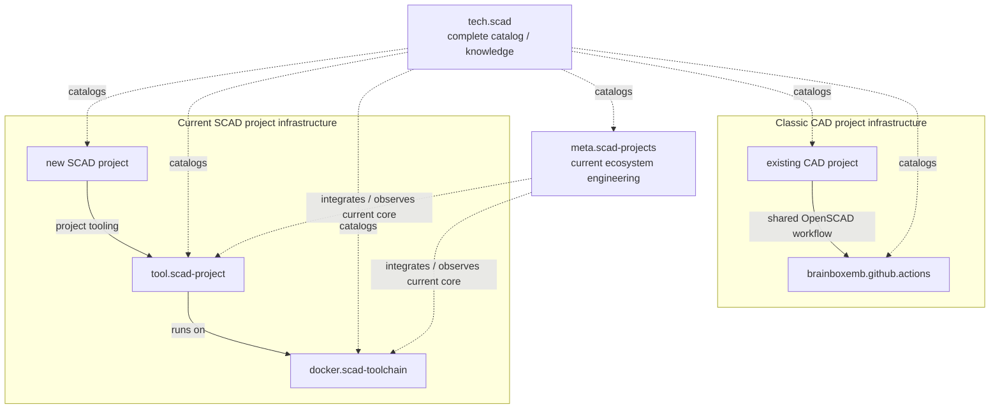

# SCAD landscape architecture

## Two different overview layers

The SCAD environment deliberately has two repositories with an overview role,
but they solve different problems.

### tech.scad

`tech.scad` is the broad catalog and knowledge layer.

It covers both generations of project infrastructure, reusable libraries and
the actual user CAD projects.

### meta.scad-projects

`meta.scad-projects` is the engineering/integration layer for maintaining the
**current** SCAD project ecosystem itself.

It focuses on a deliberately small set that can prove the shared architecture:
runtime, runtime verification, project tooling, reference template and
representative library integration.

## Project-infrastructure generations

The wider catalog includes an older and a current infrastructure generation.



`brainboxemb.github.actions` remains part of the technical landscape because
existing CAD projects use it. It is not part of the new project architecture
that `meta.scad-projects` is intended to maintain.

## Engine versus infrastructure

These are deliberately separate classifications.

```text
engine
    OpenSCAD
    PythonSCAD
    both

project infrastructure
    classic standalone
    classic shared-actions
    current tool.scad-project
```

A repository name is not sufficient evidence for an engine. `tech.scad`
should inspect repository contents before classifying a CAD project.

For OpenSCAD, actual `.scad` source provides direct evidence. For PythonSCAD,
use PythonSCAD-specific source/configuration/build evidence; a generic Python
script alone does not establish PythonSCAD use.

## Dependency rule

A normal current project must depend directly on the tooling and libraries it
needs.

```text
project
    ├── tools/tool.scad-project
    └── dsg/.../ext/lib.scad.*

not:

project
    └── tech.scad
        └── libraries
```

Classic projects may continue to call `brainboxemb.github.actions` directly.

`tech.scad` is a catalog layer and should not become a package manager or a
mandatory parent dependency.

## Source-of-truth boundaries

`tech.scad` owns:

- the curated list of repositories in the wider SCAD landscape;
- broad category and role;
- detected CAD engine classification;
- project-infrastructure generation/provider classification;
- cross-navigation and high-level knowledge documentation.

Individual repositories own:

- source code and geometry;
- project configuration;
- releases/tags;
- tests and verification;
- detailed design documentation;
- current implementation status.

`meta.scad-projects` owns:

- the controlled current integration set;
- architecture for the current development stack;
- cross-repository integration rules;
- compatibility/integration evidence.
