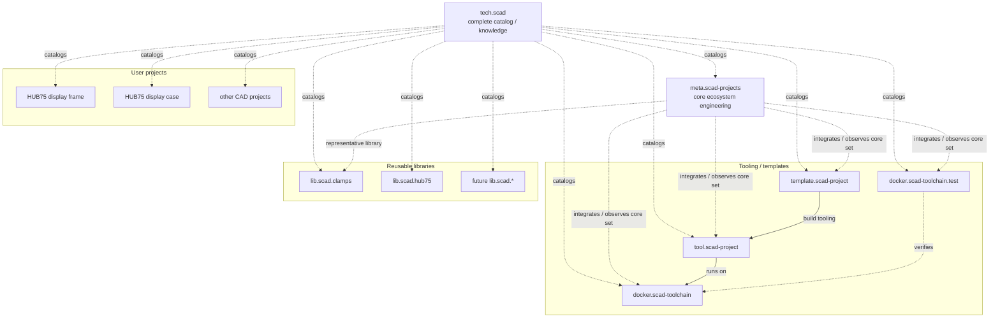

# SCAD landscape architecture

## Two different overview layers

The SCAD environment deliberately has two repositories with an overview role,
but they solve different problems.

### tech.scad

`tech.scad` is the broad catalog and knowledge layer.

It answers questions such as:

- Which reusable libraries exist?
- Which tooling is available?
- Which template should a new project start from?
- Which user CAD projects exist?
- Where does the documentation for a particular project or library live?

It should be able to grow with the number of libraries and user projects
without making those repositories integration dependencies.

### meta.scad-projects

`meta.scad-projects` is the engineering/integration layer for maintaining the
SCAD project ecosystem itself.

It focuses on a deliberately small set that can prove the shared architecture:

- runtime;
- runtime verification;
- project tooling;
- reference template;
- one or more representative libraries.

It answers different questions:

- Do the core versions work together?
- Is the project tooling compatible with the runtime?
- Does the reference template exercise the intended workflow?
- Can a representative library be consumed correctly?
- What versions/commits are pinned by the integration set?

## Relationship



Dotted `tech.scad` relationships mean **catalogs/documents**, not runtime
dependencies.

## Dependency rule

A normal project must depend directly on the tooling and libraries it needs.

```text
project
    ├── tools/tool.scad-project
    └── dsg/.../ext/lib.scad.*

not:

project
    └── tech.scad
        └── libraries
```

`tech.scad` therefore starts without a tree of Git submodules. It can discover
or query repositories later when automation is added, but should not become a
package manager or mandatory parent repository unless there is a concrete need.

## Source-of-truth boundaries

`tech.scad` owns:

- the curated list of repositories in the wider SCAD landscape;
- their broad category and role;
- cross-navigation and high-level knowledge documentation.

Individual repositories own:

- source code and geometry;
- project configuration;
- releases/tags;
- tests and verification;
- detailed design documentation;
- current implementation status.

`meta.scad-projects` owns:

- the controlled integration set;
- ecosystem architecture for the development stack;
- cross-repository integration rules;
- compatibility/integration evidence.

This separation avoids maintaining the same detailed facts in multiple places.
